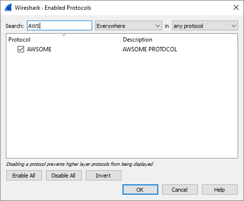

# Writing a Packet Dissector

## Setup Wireshark to Look for new Protocol
Create a variable and assign the `Proto()` function.
```Lua
--                        Protocol  Description
local MyDissector = Proto(<string>, <string>)
```
This is used in the `Analyze` -> `Enabled Protocols...` dialog.<br>
The 1st string is shown in the `Protocol` column.
The 2nd string is shown in the `Description` column.

<p align="center">
    
</p>

## Adding items to the dissection tree
```Lua
local TreeItem1 = ProtoField.uint8(
                                    <string>     -- Name of the Field
                                   ,<string>     -- Filter Name
                                   ,type         -- Field Type, e.g.: int, bool, ...
                                   [<string>]    -- Value
                                   ,[base()]     -- base.NONE, base.DEC, base.HEX, ...
                                   ,[mask()]     -- Bitmask to be used
                                   ,[<string>]   -- Description of the Field
                                   )

local TreeItem2 = ProtoField.uint8(
                                    <string>     -- Name of the Field
                                   ,<string>     -- Filter Name
                                   ,type         -- Field Type, e.g.: int, bool, ...
                                   [<string>]    -- Value
                                   ,[base()]     -- base.NONE, base.DEC, base.HEX, ...
                                   ,[mask()]     -- Bitmask to be used
                                   ,[<string>]   -- Description of the Field
                                   )
```

## Combine tree items into protocol
We should now assign the tree items, `TreeItem1` & `TreeItem2` to our protocol using the `fields` method.
```Lua
MyDissector.fields( TreeItem1, TreeItem2 )
```

## Start Dissection
We should now start dissecting the protocol using the `dissector` method.
```Lua
function MyDissector.dissector(
                               <Tvb>           -- an object that represents the packet's buffer.
                               ,<Pinfo>        -- an object that represents the packet's information.
                               ,<TreeItem>     -- an object that represents the ppacket's details
                               )
```
### `<Tvb>`
This is an object that represents the packet's buffer.<br>
It is passed as an argument to listeners and dissectors.<br>
It is used to extract information from the packet's data.<br>
It must be called with an offset and length as it's optional arguments.<br>
The offset's default value is `0`.<br>
The length's default value is `tvb:captured_len()`; basically the entire length of the packet.

**`Tvb` Members**

---

<table>
    <tr>
        <td align="center"><b>Method</b></td>
        <td align="center"><b>Arguments</b></td>
        <td align="center"><b>Description</b></td>
        <td align="center"><b>Return</b></td>
    </tr>
    <tr>
        <td colspan=2><code>tvb:__tostring()</code></td>
        <td>Convert the bytes of a <code>Tvb</code> into a string.<br>
        This is primarily useful for debugging purposes since the string will be truncated if it is too long.</td>
        <td>The string.</td>
    </tr>
    <tr>
        <td colspan=2><code>tvb:reported_len()</code></td>
        <td>Obtain the reported length (length on the network) of a <code>Tvb</code>.</td>
        <td>The reported length of the <code>Tvb</code>.</td>
    </tr>
    <tr>
        <td colspan=2><code>tvb:captured_len()</code></td>
        <td>Obtain the captured length (amount saved in the capture process) of a <code>Tvb</code>.</td>
        <td>The captured length of the <code>Tvb</code>.</td>
    </tr>
    <tr>
        <td colspan=2><code>tvb:len()</code></td>
        <td>Obtain the captured length (amount saved in the capture process) of a <code>Tvb</code>.<br>
        Same as <code>captured_len</code>; kept only for backwards compatibility</td>
        <td>The captured length of the <code>Tvb</code>.</td>
    </tr>
    <tr>
        <td colspan=2><code>tvb:reported_length_remaining()</code></td>
        <td>Obtain the reported (not captured) length of packet data to end of a <code>Tvb</code> or <code>0</code> if the offset is beyond the end of the <code>Tvb</code>.</td>
        <td>The captured length of the <code>Tvb</code>.</td>
    </tr>
    <tr>
        <td colspan=2><code>tvb:bytes([int], [int])</code></td>
        <td>Obtain a ByteArray from a <code>Tvb</code>.</td>
        <td>The ByteArray object or nil.</td>
    </tr>
    <tr>
        <td></td>
        <td><code>[offset]</code></td>
        <td>The offset (in octets) from the beginning of the <code>Tvb</code>.<br>Default: <code>0</code>.</td>
        <td></td>
    </tr>
    <tr>
        <td></td>
        <td><code>[length]</code></td>
        <td>The offset (in octets) from the beginning of the <code>Tvb</code>.<br>Default: <code>0</code>.</td>
        <td></td>
    </tr>
    <tr>
        <td colspan=2><code>tvb:offset()</code></td>
        <td>Returns the raw offset (from the beginning of the source <code>Tvb</code>) of a sub <code>Tvb</code>.</td>
        <td>The raw offset of the <code>Tvb</code>.</td>
    </tr>
    <tr>
        <td colspan=2><code>tvb:__call()</code></td>
        <td>Equivalent to <code>tvb:range(…)</code></td>
    </tr>
    <tr>
        <td colspan=2><code>tvb:range([int], [int])</code></td>
        <td>Creates a <code>TvbRange</code> from this <code>Tvb</code>.</td>
        <td>The <code>TvbRange</code></td>
    </tr>
    <tr>
        <td></td>
        <td><code>[offset]</code></td>
        <td>The offset (in octets) from the beginning of the <code>Tvb</code>.<br>Default: <code>0</code>.</td>
        <td></td>
    </tr>
    <tr>
        <td></td>
        <td><code>[length]</code></td>
        <td>The length (in octets) of the range.<br>
        Default: <code>-1</code> (specifies remaining bytes in the <code>Tvb</code>).</td>
        <td></td>
    </tr>
    <tr>
        <td colspan=2><code>tvb:raw([int], [int])</code></td>
        <td>Obtain a Lua string of the binary bytes in a <code>Tvb</code>.</td>
        <td>A Lua string of the binary bytes in the <code>Tvb</code>.</td>
    </tr>
    <tr>
        <td></td>
        <td><code>[offset]</code></td>
        <td>The position of the first byte.<br>Default: <code>0</code> (first byte)</td>
        <td></td>
    </tr>
    <tr>
        <td></td>
        <td><code>[length]</code></td>
        <td>The length of the segment to get.<br>
        Default: <code>-1</code> (remaining bytes) in the <code>Tvb</code>.</td>
        <td></td>
    </tr>
    <tr>
        <td colspan=2><code>tvb:__eq()</code></td>
        <td></td>
        <td>Checks whether contents of two <code>Tvb</code>s are equal.</td>
    </tr>
</table>


---

### `<Pinfo>`
An object that represents packet's information.