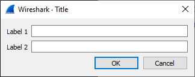
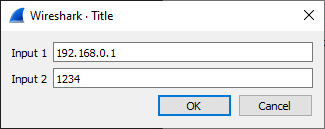

# Wireshark Lua API

## `TextWindow`
Creates & displays a new text window.

### Usage:<br>
`TextWindow.new([string])`<br>

### Default value:<br>
*Untitled Window*

### Methods of `TextWindow` Object.
|            Function            |                        Definition                        |
|--------------------------------|----------------------------------------------------------|
| `set_atclose(function)`        | A function to call when `TextWindow` is closed.          |
| `set(string)`                  | Sets the text to be displayed in the TextWindow.         |
| `append(text)`                 | Appends text to the current window.                      |
| `prepend(text)`                | Prepends text to the current window.                     |
| `clear()`                      | Erases all text in the window.                           |
| `get_text()`                   | Get text of the window.                                  |
| `close()`                      | Closes the window.                                       |
| `set_editable([bool])`         | Default value: *true*<br>Allows the text to be editable. |
| `add_button(string, function)` | Adds button to the window.                               |
---

## `new_dialog(string, function, ...)`
Displays a dialog prompting for user input with `OK` & `Cancel` buttons.

* `string` will be the title of the window.<br>
* `function` will be called after `OK` is pressed.<br>
* `...` can be a set of strings used as input labels.<br>
This can also be a table with special fields `name` & `value`, both of which expect strings.<br>
`name` is used as the label of the input.<br>
`value` is used as the prefilled text of the input.

### Examples
`new_dialog` with input labels as strings.
```Lua
local function LC() end
new_dialog("Title", LC, "Input 1", "Input 2");
```
<p align="center">
    
</p>

`new_dialog` with input labels from a table to make use of prefilled texts.
```Lua
local input1 =	{
					 name  = "Input 1"
					,value = "192.168.0.1"
				}

local input2 =	{
					 name  = "Input 2"
					,value = "1234"
				}

local function LC() end
new_dialog("Title", LC, input1, input2);
```
<p align="center">
    
</p>